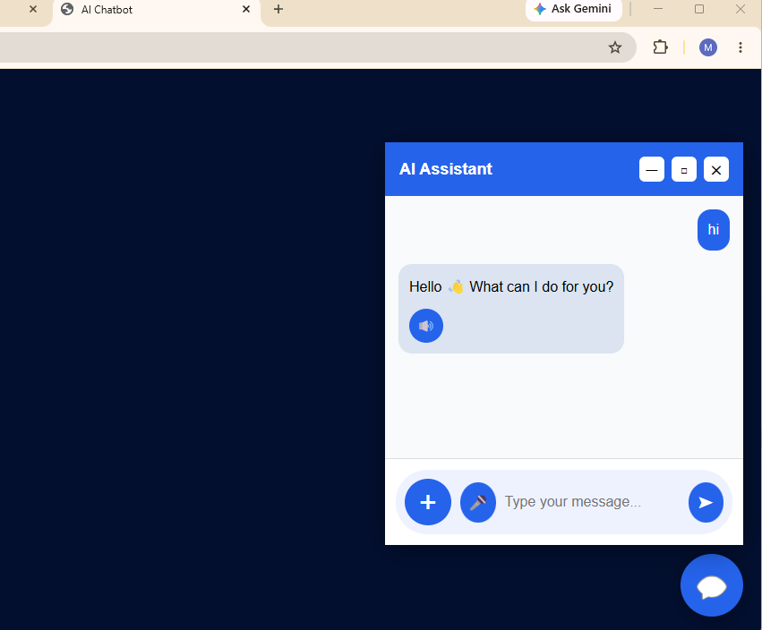
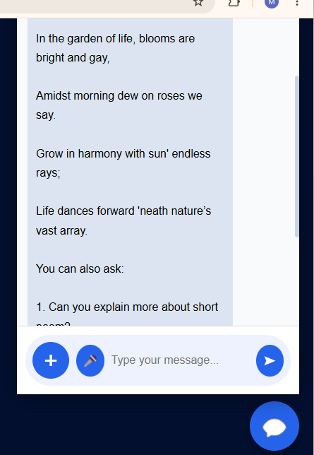
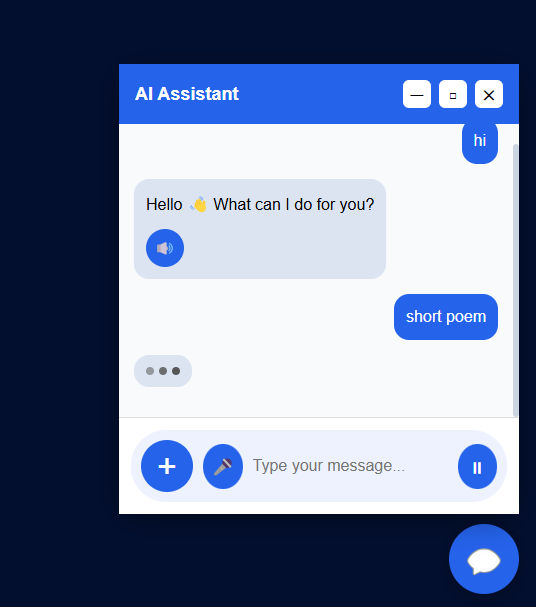
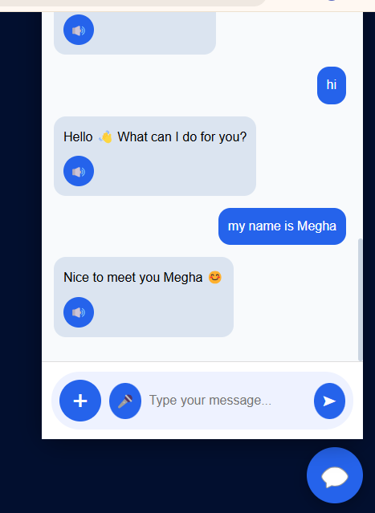
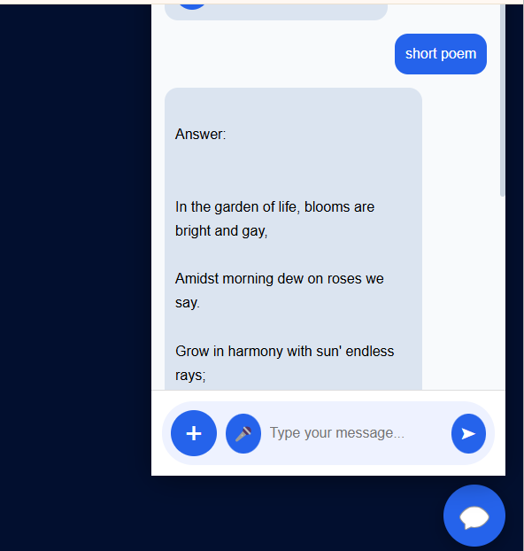

# 🤖 Multi-Modal AI Assistant

An intelligent AI Assistant built using Python, Flask, and Ollama that combines conversational AI, document understanding, voice interaction, image analysis, and personalized memory into a single application.

This project demonstrates practical Generative AI concepts including Large Language Models (LLMs), Retrieval-Augmented Generation (RAG), Speech-to-Text (STT), Text-to-Speech (TTS), conversational memory, and document intelligence.

---

## 🚀 Features

### 💬 Conversational AI
- Natural language conversations using Ollama LLMs
- Context-aware responses
- Interactive chatbot interface

### 🧠 User Memory & Personalization
- Stores user information such as name
- Remembers previous interactions
- Personalized responses based on conversation history

### 🎤 Speech-to-Text (STT)
- Voice input support
- Converts speech into text for AI processing
- Hands-free interaction experience

### 🔊 Text-to-Speech (TTS)
- Converts AI responses into speech
- Voice-enabled AI assistant
- Improves accessibility and user experience

### 📄 PDF Question Answering (RAG)
- Upload PDF documents
- Ask questions about document content
- Semantic retrieval using vector search
- Context-aware answers from uploaded files

### 📑 DOCX Document Processing
- Upload DOCX documents
- Extract and analyze document content
- AI-powered document understanding

### 🖼️ Image Analysis
- Upload images for AI analysis
- Generate descriptions and insights
- Multi-modal interaction support

### 📂 Multi-Format File Upload
Supports:
- PDF Files
- DOCX Files
- Images (PNG, JPG, JPEG)

### 🌐 Web Search Integration
- Retrieves external information
- Enhances AI responses with additional context

### ⏳ Typing Indicator
- Real-time typing animation
- Improved conversational experience

---

## 🏗️ Architecture

```text
User Input
     │
     ▼
Flask Web Application
     │
 ┌───┼──────────────────────┐
 │   │                      │
 ▼   ▼                      ▼
Voice  Document Upload   Image Upload
(STT)  PDF / DOCX         Analysis
 │          │                │
 ▼          ▼                ▼
Text Extraction & Processing
 │
 ▼
Embeddings Generation
 │
 ▼
FAISS Vector Database
 │
 ▼
Similarity Search
 │
 ▼
Relevant Context Retrieval
 │
 ▼
Ollama LLM
 │
 ▼
AI Response Generation
 │
 ▼
Text Response + Voice Output
(TTS)
```

---

## 🛠️ Technology Stack

### AI & LLM
- Ollama
- Llama 3
- LangChain
- Retrieval-Augmented Generation (RAG)

### Backend
- Python
- Flask

### Vector Database
- FAISS

### Embeddings
- Hugging Face Embeddings
- Sentence Transformers

### Voice Technologies
- SpeechRecognition
- pyttsx3

### Frontend
- HTML
- CSS
- JavaScript

### Data Processing
- PyPDF
- DOCX Processing

---

## 📸 Screenshots

### 🏠 Home Page



---

### 💬 Chat Interface



---

### ⏳ Typing Indicator



---

### 🧠 User Memory

The assistant remembers user information and provides personalized responses.



---

### ✨ AI Generated Response

Example of AI-generated content.



---

## 📂 Project Structure

```text
ai-multimodal-assistant/
│
├── app.py
├── requirements.txt
│
├── templates/
│
├── static/
│   ├── css/
│   ├── js/
│   ├── uploads/
│
├── screenshots/
│
└── README.md
```

---

## ⚙️ Installation

### Clone Repository

```bash
git clone https://github.com/yourusername/ai-multimodal-assistant.git

cd ai-multimodal-assistant
```

### Create Virtual Environment

```bash
python -m venv venv
```

### Activate Environment

Windows:

```bash
venv\Scripts\activate
```

### Install Dependencies

```bash
pip install -r requirements.txt
```

### Install Ollama

Download and install:

https://ollama.com

Pull model:

```bash
ollama pull llama3
```

### Run Application

```bash
python app.py
```

Open:

```text
http://127.0.0.1:5000
```

---

## 🎯 Key AI Concepts Demonstrated

- Generative AI
- Large Language Models (LLMs)
- Retrieval-Augmented Generation (RAG)
- Conversational AI
- Prompt Engineering
- User Personalization
- Conversational Memory
- Speech-to-Text
- Text-to-Speech
- Vector Search
- Semantic Retrieval
- Document Intelligence
- Multi-Modal AI Systems

---

## 👩‍💻 Author

**Meghana V**

AI Application Developer | Generative AI Enthusiast | Python Developer

LinkedIn: Add your LinkedIn URL

GitHub: Add your GitHub URL

---

## ⭐ Future Enhancements

- Persistent memory using SQLite
- Multi-user authentication
- Advanced image understanding
- Chat history export
- Cloud deployment
- Vector memory storage
- LangGraph integration# ai-multimodal-assistant
Multi-Modal AI Assistant built with Python, Flask, Ollama, RAG, Speech-to-Text, Text-to-Speech, Memory, PDF Question Answering, Image Analysis, and Web Search capabilities.
